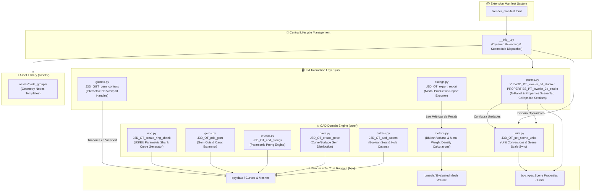

# 🏗️ Arquitectura del Proyecto — Jeweler 3D Studio (Blender 4.2+ Extension)

> **Diagrama vivo de arquitectura y mapa de componentes del Addon de Joyería 3D para Blender 4.2+ / 5.x+**.

---

## 📊 Diagrama de Componentes y Flujo de Ejecución

---

## 🏛️ Desglose de Capas y Responsabilidades

| Capa | Archivos / Módulos | Clase / Función Principal | Responsabilidad |
|---|---|---|---|
| **Manifiesto** | `blender_manifest.toml` | Standard TOML Manifest | Metadatos de la extensión, versión mínima de Blender (4.2.0), tags y licencias. |
| **Lifecycle** | `__init__.py` | `register()`, `unregister()` | Recarga dinámica `importlib.reload()` y registro simétrico secuencial de paquetes `core`, `ui` y `assets`. |
| **Core Init** | `core/__init__.py` | `register()`, `unregister()` | Punto de montaje modular del motor CAD con verificación resiliente `hasattr`. |
| **UI Init** | `ui/__init__.py` | `register()`, `unregister()` | Registro de paneles N-Panel, diálogos modales y GizmoGroups. |
| **UI Panels** | `ui/panels.py` | `VIEW3D_PT_jeweler_3d_studio` | Interfaz N-Panel responsiva con secciones colapsables (Anillo Base, Gemas, Cortadores, Métricas, Unidades). |
| **UI Dialogs** | `ui/dialogs.py` | `J3D_OT_export_report` | Exportador de fichas técnicas de producción en formato de texto/JSON con peso estimado y volumen. |
| **UI Gizmos** | `ui/gizmos.py` | `J3D_GGT_gem_controls` | Tiradores visuales 3D interactivos en el Viewport para manipulación directa de gemas y cortadores. |
| **Domain: Units** | `core/units.py` | `mm_to_bu()`, `J3D_OT_set_scene_units` | Conversión universal mm/BU y operador para sincronizar Scene Properties a milímetros (0.001 scale / mm). |
| **Domain: Ring** | `core/ring.py` | `J3D_OT_create_ring_size`, `J3D_OT_create_ring_profile` | Generador paramétrico de curvas/mallas de talla US (3.0-13.5), 8 perfiles de metal con sweep BMesh, orientación (Top/Front/Side), Subsurf y Edge Crease (0.8). |
| **Domain: Gems** | `core/gems.py` | `J3D_OT_add_gem` | Creación de piedras preciosas parametrizadas (Redonda, Princesa, Oval, Esmeralda, Pera, Marquesa) y cálculo de quilates. |
| **Domain: Prongs** | `core/prongs.py` | `J3D_OT_add_prongs` | Engaste de garras paramétricas (Redonda, Garra, V-Prong, Cuadrada) vinculadas a la gema activa. |
| **Domain: Pavé** | `core/pave.py` | `J3D_OT_create_pave` | Algoritmo de distribución de gemas sobre curvas 3D y mallas de superficie. |
| **Domain: Cutters** | `core/cutters.py` | `J3D_OT_add_cutters` | Cortadores booleanos para asientos de filetín, perforaciones de entrada de luz y biseles completos. |
| **Domain: Metrics**| `core/metrics.py` | `calculate_mesh_volume_cm3()` | Cálculo preciso de volumen $cm^3$ mediante `bmesh` y peso estimado en Oro (24K, 18K, 14K), Platino, Plata y Titanio. |
| **Assets** | `assets/node_groups/` | Geometry Nodes Library | Plantillas de nodos no destructivos para modificadores de Blender. |
